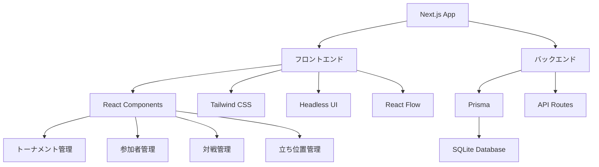

# トーナメント管理アプリケーション

Next.jsを使用したトーナメント管理アプリケーションです。対戦時の立ち位置（東、西、南、北など）を指定・管理できる機能を備えています。

## 機能

- トーナメントの作成・管理
- 参加者の登録・管理
- 対戦組み合わせの自動生成
- 対戦時の立ち位置の指定・管理
- 立ち位置の入れ替え機能

## 技術スタック

- Next.js (App Router)
- TypeScript
- Tailwind CSS
- Prisma (SQLite)
- Headless UI
- Heroicons
- React Flow (トーナメント図の可視化)

## プロジェクト構成



## セットアップ手順

1. プロジェクトの作成
```bash
npx create-next-app@latest . --typescript --tailwind --eslint --app --src-dir --import-alias "@/*"
```

2. 必要なパッケージのインストール
```bash
npm install @prisma/client prisma @headlessui/react @heroicons/react
```

3. Prismaの初期化
```bash
npx prisma init
```

4. データベースの設定
`.env`ファイルに以下の内容を追加：
```
DATABASE_URL="file:./dev.db"
```

5. データベースのマイグレーション
```bash
npx prisma migrate dev --name init
```

## データベーススキーマ

### Tournament（トーナメント）
- id: 一意のID
- name: トーナメント名
- description: 説明（任意）
- createdAt: 作成日時
- updatedAt: 更新日時

### Participant（参加者）
- id: 一意のID
- name: 参加者名
- tournamentId: 所属トーナメントのID
- player1Matches: プレイヤー1としての対戦
- player2Matches: プレイヤー2としての対戦

### Match（対戦）
- id: 一意のID
- round: ラウンド番号
- tournamentId: トーナメントID
- player1Id: プレイヤー1のID
- player2Id: プレイヤー2のID
- winnerId: 勝者のID（任意）
- positions: 立ち位置情報

### Position（立ち位置）
- id: 一意のID
- name: 位置名（東、西、南、北など）
- matchId: 対戦ID
- participantId: 参加者ID

## 開発環境の起動

```bash
npm run dev
```

## テストの実行

```bash
npm test
```

## ライセンス

MIT
